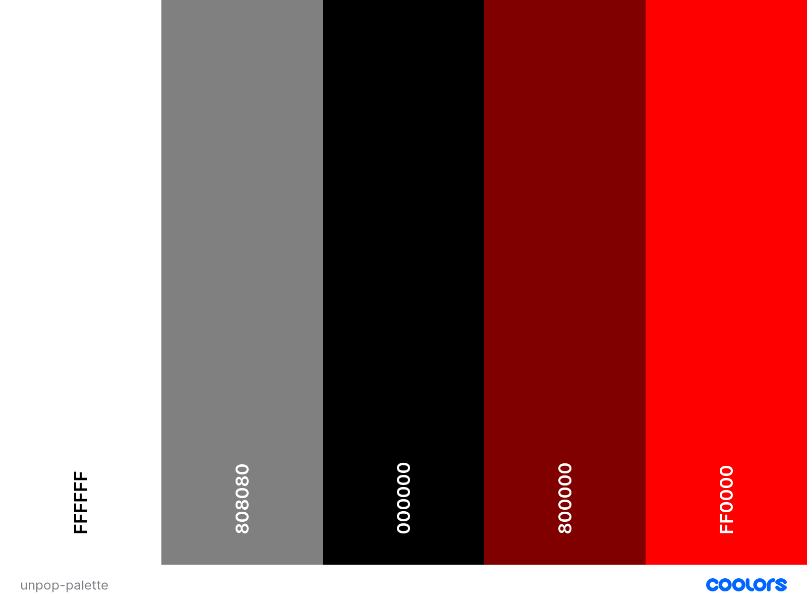
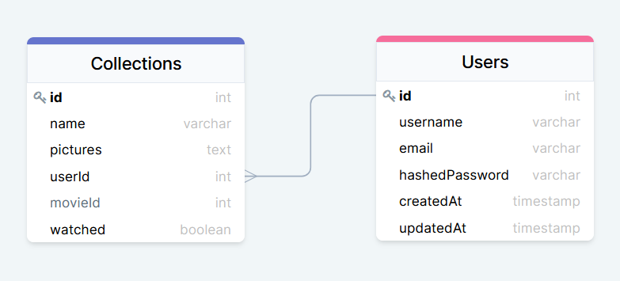

# [Unpopuhorroropinion](https://unpopuhorroropinion.herokuapp.com/) - 
*by [Damien Darko](https://damiendarko.com/)*

Table Of Contents:
---
- [Description](https://github.com/djangothesolarboy/unpopuhorroropinion#description)
- [Application Architecture & Technologies Used](https://github.com/djangothesolarboy/unpopuhorroropinion#application-architecture--techonologies-used)
- [Installation](https://github.com/djangothesolarboy/unpopuhorroropinion#installation)
- [Frontend Overview](https://github.com/djangothesolarboy/unpopuhorroropinion#frontend-overview)
- [Backend Overview](https://github.com/djangothesolarboy/unpopuhorroropinion#backend-overview)
- [Screenshots](https://github.com/djangothesolarboy/unpopuhorroropinion#screenshots)
- [Technology Shields](https://github.com/djangothesolarboy/unpopuhorroropinion#technology-shields)

Description:
---
Unpopunhorroropinion is a site where horror lovers can go to catalog their collection and share photos of their collection with other horror lovers. It is meant to not only be a catalog of what films you own, but also a place to share the love of horror. Along with the ability of reviewing your favorite, or most hated horror films in your collection!

Application Architecture & Techonologies Used:
---
[Unpopuhorroropinion](https://unpopuhorroropinion.herokuapp.com/) was built using Express NodeJS framework with a PostgreSQL(postgres) database on the backend. The frontend uses Javascript, HTML, CSS, React and Redux.

Frontend Overview:
---
The frontend was built using Javascript, HTML, CSS, React and Redux. It utilizes Redux the store and components to create a more readable file structure.

Fonts Used:
[Big Shoulders Display(Google Fonts)](https://fonts.google.com/specimen/Big+Shoulders+Display?preview.text_type=custom&sidebar.open=true&selection.family=Big+Shoulders+Display:wght@100;400;900&query=big+shoul)
[Creepster(Google Fonts)](https://fonts.google.com/specimen/Creepster?preview.text_type=custom&selection.family=Big+Shoulders+Display:wght@100;400;900|Creepster&query=creepster)

[Color Palette:](https://coolors.co/ffffff-808080-000000-800000-ff0000)
---
- White: `#ffffff`
- Gray Web: `#808080`
- Black: `#000000`
- Maroon Web: `#800000`
- Red: `#ff0000`  

Backend Overview:
---
The backend uses Express NodeJS framework with a PostgreSQL database. It also uses the TMDB api to make fetch requests for information on films. The movie's id from the TMDB api is stored in the database via an array.

Tables:
---
Table Name | Columns
---|---
Users | username, email, hashedPassword, createdAt, updatedAt
Collections | name, pictures, watched, userId, movieId

Screenshots:
---
  
  
  

Technology Shields:
---
 
 
 
 
 
 
 
  