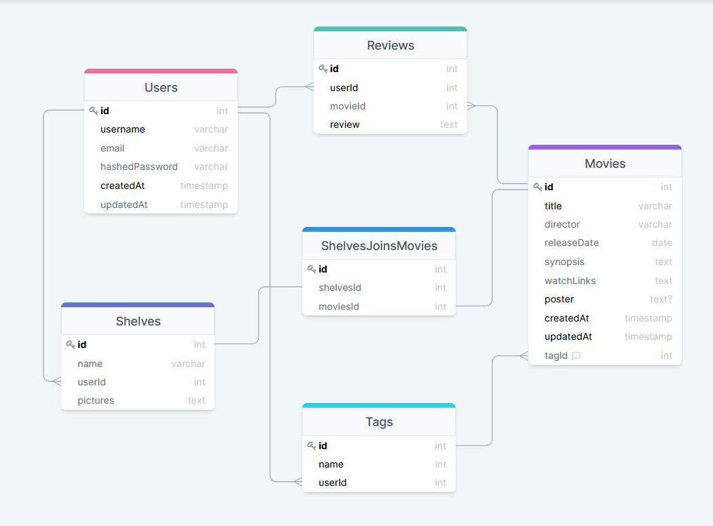

# [Unpopuhorroropinion](https://unpopuhorroropinion.com/) - 
*by [Damien Darko](https://damiendarko.com/)*

Table Of Contents:
---
- [Description]()
- [Application Architecture & Technologies Used]()
- [Installation]()
- [Frontend Overview]()
- [Backend Overview]()

Description:
---
Unpopunhorroropinion.com is a site where horror lovers can go to catalog their collection and share photos of their collection with other horror lovers. It is meant to not only be a catalog of what films you own, but also a place to share the love of horror. Along with the ability of reviewing your favorite, or most hated horror films in your collection!

Application Architecture & Techonologies Used:
---

Frontend Overview:
---

[Color Palette](https://coolors.co/ffffff-808080-000000-800000-ff0000)  

Backend Overview:
---

Tables:
---
Table Name | Columns
---|---
Users | username, email, hashedPassword, createdAt, updatedAt
Movies | title, director, releaseDate, synopsis, poster, tagId, watchLinks, createdAt, updatedAt
Shelves | name, userId, pictures
ShelvesJoinsMovies | shelvesId, movieId
Reviews | userId, movieId, review
Tags | name, userId

